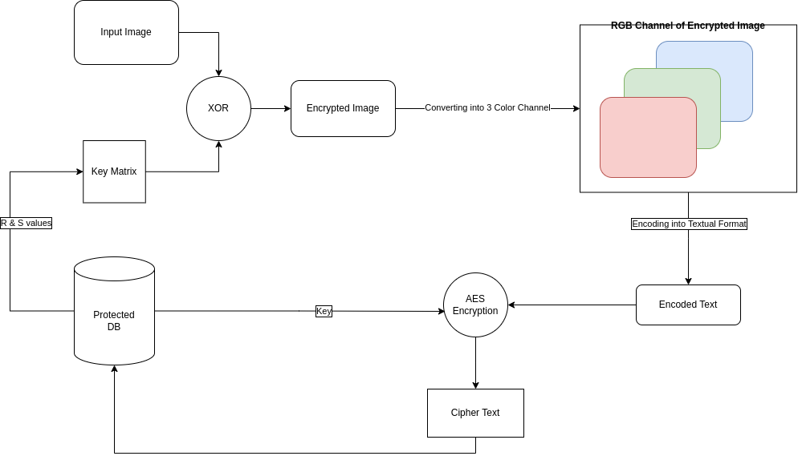
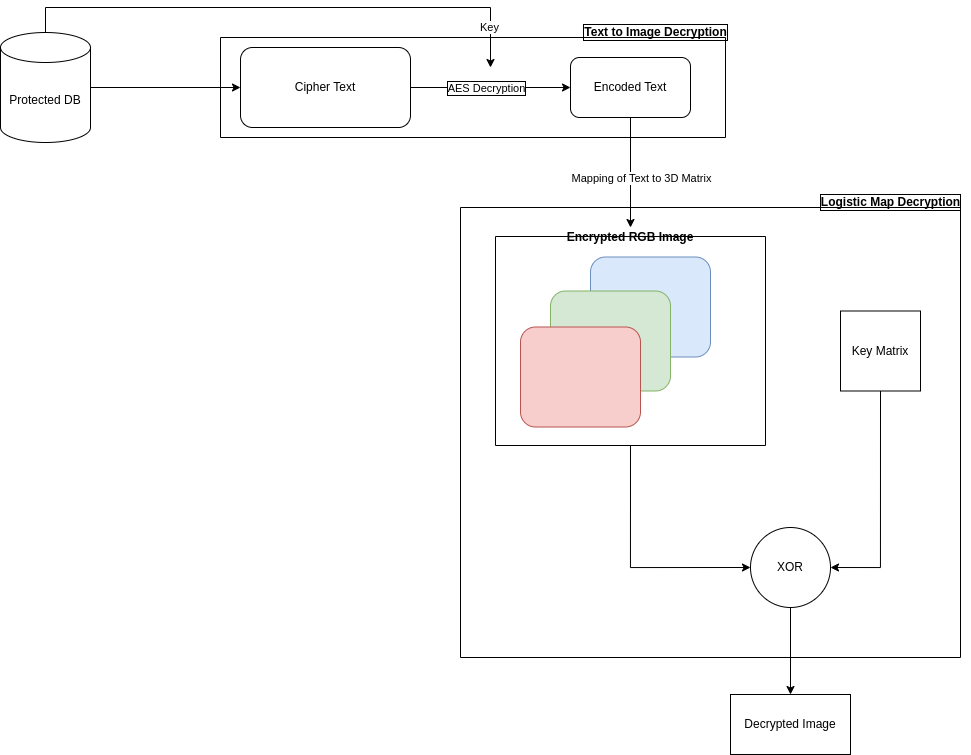
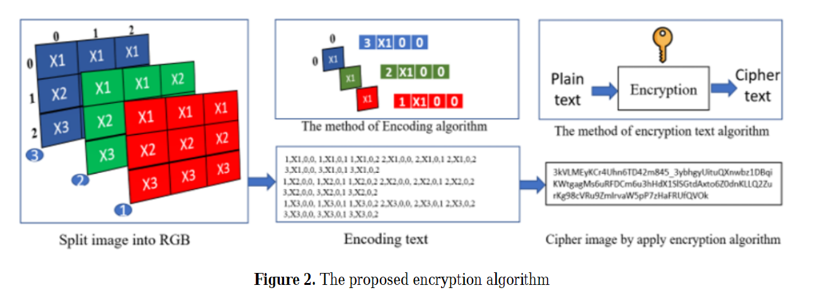
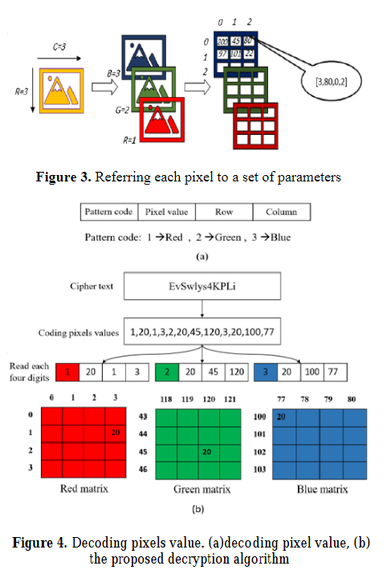

# Image Encryption

This is a project in cryptography that involves implementing image encryption, first encrypting images using chaotic maps (logistic maps) and then encrypting the image to text using AES Encryption.

# Basic Flow

- Encryption



- Decryption




## Image To Image Encryption & Decryption

### What are chaos maps?
Chaotic systems are a simple sub-type of nonlinear dynamical systems. They contain a few interacting parts which follow simple rules, but these systems are characterized by a very sensitive dependence on their initial conditions. Despite their deterministic simplicity, over time these systems can display and divergent behavior.

### Why Chaos Maps for encryption?
Traditional encrypting mechanisms AES and RSA exhibit some drawbacks and weakness when it comes to encryption of digital images and high computing

- Large computational time for large images
- High computing power for large images

Consequently, there might be better techniques for image encryption.

A few chaos based algorithms provide a good combination of speed, high security complexity, low computational overheads Moreover, certain chaos-based and other dynamical systems based algorithms have many important properties such as

- sensitive dependence on initial parameters
- pseudorandom properties
- ergodicity
- non periodicity

### How does logistic map work?

The logistic map uses a nonlinear difference equation to look at discrete time steps. It’s called the logistic map because it maps the population value at any time step to its value at the next time step.

The basic formula is: X<sub>t+1</sub> = r * X<sub>t</sub> * (1 - X<sub>t</sub>)

- the initial seed value **Seed** is set for generating the key array.
- the parameter **r** represents the chaotic behaviour. Changing **r** can change choatic behaviour.

Then, the elements of key array are XORed with each pixel values of the image in order to get the encrypted image. This same process can be done at the receiver end to decrypt the image.

## Image To Text Encryption & Decryption

### What is IMGTXT?

IMGTXT is a novel image encryption technique that goes beyond conventional methods. It converts images into text, encoding pixel values based on their locations and then encrypting them using trusted text encryption algorithms. 

### Why Image to Text Encryption?

This innovative approach provides resistance to various attacks, ensuring image privacy. The resulting ciphertext is text-based, making it challenging for attackers to break the encryption and distinguish the original image. 

IMGTXT combines efficiency, security, and adaptability, making it an intriguing choice for image encryption. This repository contains the code and research findings related to the IMGTXT image encryption approach.

### How does this work?

This technique involves, firstly create  a matrix of each Numerical pixel  value  (0-255)  from  the  input  color  image  and  then represent a value by  indexing its (row and Colum) to get  the coding  value,  finally  after  encoding  all  together,  it  will  be encrypted to create ciphertext. This work has three phases.

- Encoding pixels for the encryption process.
- Decoding pixels for the decryption process.
- Conventional cryptographic method for a text that used a key for both encryption and decryption.

#### Encryption Algorithm

For image encryption, two techniques are used. The first one converts the image to text. The second one encrypts text using a suitable encryption algorithm (in this case - AES)

1. First the image is encoded into an encoding array with the encoding character as
   <p style="text-align: center;">Encoding character = P & X & R & C</p> 

    where,<br>
    P = 1 if image selection is Red, 2 if image selection is Green, 3 if image selection is Blue<br>
    X = pixel value (0-255)<br>
    R = row of the pixel<br>
    C = column of the pixel

2. Then the encoding data is encrypted using symmetric type encryption algorithm (an AES cipher with a key size of 128 bits was used).
   


#### Decryption Algorithm

For image decryption, two techniques are used. 

1. The  first  stage  of  the  decryption  process  begins  with converting the ciphertext into plain text, which represents the pixel contrast encoding of the image, and it is done with the same algorithm used for the encryption and with the same key.
   
2. Second, the plain text will represent the image data, where it  will  be  decoded  and  converted  into  three  matrixes  that represent  the  RGB  colors  that  make  up the  image.




# Getting Started

## Dependencies

* Clone the repository using the command below:

```
git clone https://github.com/Amit-Ramrakhyani/Image-Encryption.git
```

* Move into the directory where we have the project files :
  
```
cd Image-Encryption
```

* Create a virtual environment :
  
```bash
pip install virtualenv

virtualenv venv

```

* Activate the virtual environment :
```bash
venv\Scripts\activate
```

* Install the requirements :
```bash
pip install -r requirements.txt

```

## Executing the program

- Use the following command in the command prompt to *input and resize the image*:

```
python3 resize_image.py
```

- Use the following command in the command prompt to *encrypt image to image*:

```
python3 ImageToImageEncryption.py
```

- Use the following command in the command prompt to *encrypt image to text*:

```
python3 ImageToTextEncryption.py
```

- Use the following command in the command prompt to *decrypt text to image*:

```
python3 TextToImageEncryption.py
```

- Use the following command in the command prompt to *decrypt image to image*:

```
python3 ImageToImageDecryption.py
```


# Future Scopes and updates

- Add new features like videos to text, text to audio, image to audio, text to image, etc
- Encrypting specific parts of the images/videos


# Current Issues

# References

<a href='https://www.researchgate.net/publication/360251627_IMGTXT_Image_to_Text_Encryption_Based_on_Encoding_Pixel_Contrasts'>Seerwan Waleed Jirjees. Farah F. Alkhalid.(2022) IMGTXT: Image to Text Encryption Based on Encoding Pixel Contrasts</a>

<a href='https://www.jcscm.net/fp/32.pdf'>Kamal Jadidy Aval, Morteza Sabery Kamarposhty, Masumeh Damrudi(2013). A Simple Method for Image Encryption Using Chaotic Logistic Map</a>

